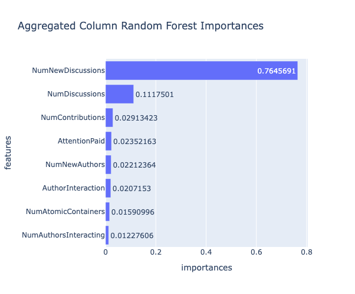
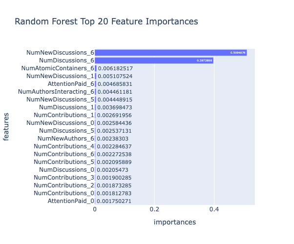
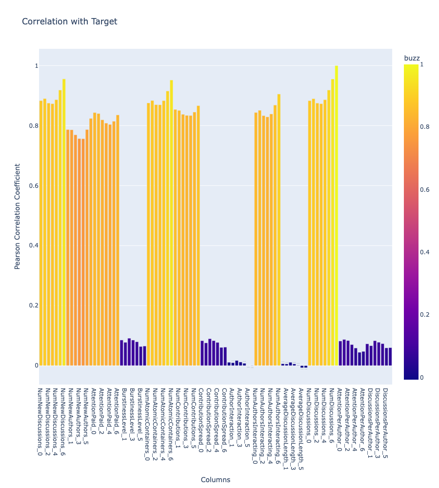
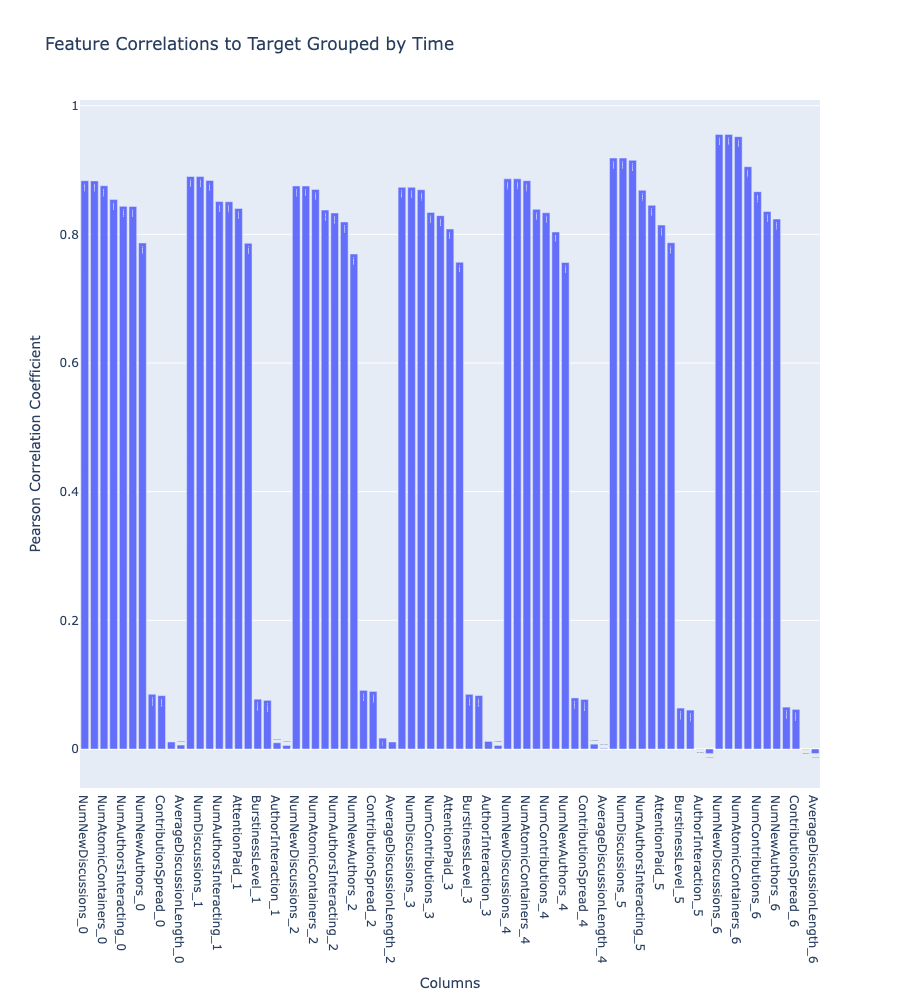

Link to dataset: https://archive.ics.uci.edu/dataset/248/buzz+in+social+media

# Introduction
This notebook analyzes the Twitter dataset from the Buzz Prediction dataset. The target variable is the mean number of active discussions (NAD) of an instance's topic. Each row is a measurement of a feature of a topic **z**, with each feature representing a time **t** in (0,6).

There are 11 features in the Twitter dataset. Each are marked with a suffix [0, 6] denoting a timestamp. The dataset description included descriptive statistics on the features.

# Data Loading
The Twitter dataset contained 583,250 rows and 78 columns. The columns measured various statistics about the social media platform.

The features were split into 11 groups. Each group was measured at a time **t** in 7 periods. The features were renamed in the working dataset as listed in the table below.

The target feature measured the mean number of active discussions.

<table align="center">
  <thead>
    <tr>
      <th>Abbreviation</th>
      <th>Full Form</th>
    </tr>
  </thead>
  <tbody>
    <tr><td><code>NCD</code></td><td>NumNewDiscussions</td></tr>
    <tr><td><code>AI</code></td><td>NumNewAuthors</td></tr>
    <tr><td><code>AS_NA</code></td><td>AttentionPaid</td></tr>
    <tr><td><code>BL</code></td><td>BurstinessLevel</td></tr>
    <tr><td><code>NAC</code></td><td>NumAtomicContainers</td></tr>
    <tr><td><code>AS_NAC</code></td><td>NumContributions</td></tr>
    <tr><td><code>CS</code></td><td>ContributionSpread</td></tr>
    <tr><td><code>AT</code></td><td>AuthorInteraction</td></tr>
    <tr><td><code>NA</code></td><td>NumAuthorsInteracting</td></tr>
    <tr><td><code>ADL</code></td><td>AverageDiscussionLength</td></tr>
    <tr><td><code>NAD</code></td><td>NumDiscussions</td></tr>
    <tr><td><code>buzz</code></td><td>buzz (target)</td></tr>
  </tbody>
</table>

# Feature Engineering
This analysis created 2 features called **DiscussionsPerAuthor** and **AttentionPerAuthor**.

DiscussionsPerAuthor_t was defined as the ratio between ContributionSpread_t and AuthorInteraction_t at time **t**. 

AttentionPerAuthor_t was defined as the ratio between NumContributions_t and AttentionPaid_t at time **t**.

The BurstinessLevel feature was an existing ratio feature, and it used 0.0 in place of 0/0 divisions. This analysis made the same modification to the DiscussionsPerAuthor and AttentionPerAuthor features.

# EDA
The dataset included descriptive statistics on the feature groups. This analysis also performed summary statistic analysis, distribution analysis using skew and kurtosis, and correlation analysis.

<table>
  <thead>
    <tr>
      <th>Statistic</th>
      <th>NumNewDiscussions_0</th>
      <th>NumNewDiscussions_1</th>
      <th>NumNewDiscussions_2</th>
      <th>NumNewDiscussions_3</th>
      <th>NumNewDiscussions_4</th>
      <th>NumNewDiscussions_5</th>
      <th>NumNewDiscussions_6</th>
      <th>NumNewAuthors_0</th>
      <th>NumNewAuthors_1</th>
      <th>NumNewAuthors_2</th>
      <th>NumNewAuthors_3</th>
      <th>NumNewAuthors_4</th>
      <th>NumNewAuthors_5</th>
      <th>NumNewAuthors_6</th>
      <th>AttentionPaid_0</th>
      <th>AttentionPaid_1</th>
      <th>AttentionPaid_2</th>
      <th>AttentionPaid_3</th>
      <th>AttentionPaid_4</th>
      <th>AttentionPaid_5</th>
      <th>AttentionPaid_6</th>
      <th>BurstinessLevel_0</th>
      <th>BurstinessLevel_1</th>
      <th>BurstinessLevel_2</th>
      <th>BurstinessLevel_3</th>
      <th>BurstinessLevel_4</th>
      <th>BurstinessLevel_5</th>
      <th>BurstinessLevel_6</th>
      <th>NumAtomicContainers_0</th>
      <th>NumAtomicContainers_1</th>
      <th>NumAtomicContainers_2</th>
      <th>NumAtomicContainers_3</th>
      <th>NumAtomicContainers_4</th>
      <th>NumAtomicContainers_5</th>
      <th>NumAtomicContainers_6</th>
      <th>NumContributions_0</th>
      <th>NumContributions_1</th>
      <th>NumContributions_2</th>
      <th>NumContributions_3</th>
      <th>NumContributions_4</th>
      <th>NumContributions_5</th>
      <th>NumContributions_6</th>
      <th>ContributionSpread_0</th>
      <th>ContributionSpread_1</th>
      <th>ContributionSpread_2</th>
      <th>ContributionSpread_3</th>
      <th>ContributionSpread_4</th>
      <th>ContributionSpread_5</th>
      <th>ContributionSpread_6</th>
      <th>AuthorInteraction_0</th>
      <th>AuthorInteraction_1</th>
      <th>AuthorInteraction_2</th>
      <th>AuthorInteraction_3</th>
      <th>AuthorInteraction_4</th>
      <th>AuthorInteraction_5</th>
      <th>AuthorInteraction_6</th>
      <th>NumAuthorsInteracting_0</th>
      <th>NumAuthorsInteracting_1</th>
      <th>NumAuthorsInteracting_2</th>
      <th>NumAuthorsInteracting_3</th>
      <th>NumAuthorsInteracting_4</th>
      <th>NumAuthorsInteracting_5</th>
      <th>NumAuthorsInteracting_6</th>
      <th>AverageDiscussionLength_0</th>
      <th>AverageDiscussionLength_1</th>
      <th>AverageDiscussionLength_2</th>
      <th>AverageDiscussionLength_3</th>
      <th>AverageDiscussionLength_4</th>
      <th>AverageDiscussionLength_5</th>
      <th>AverageDiscussionLength_6</th>
      <th>NumDiscussions_0</th>
      <th>NumDiscussions_1</th>
      <th>NumDiscussions_2</th>
      <th>NumDiscussions_3</th>
      <th>NumDiscussions_4</th>
      <th>NumDiscussions_5</th>
      <th>NumDiscussions_6</th>
      <th>buzz</th>
      <th>DiscussionsPerAuthor_0</th>
      <th>DiscussionsPerAuthor_1</th>
      <th>DiscussionsPerAuthor_2</th>
      <th>DiscussionsPerAuthor_3</th>
      <th>DiscussionsPerAuthor_4</th>
      <th>DiscussionsPerAuthor_5</th>
      <th>DiscussionsPerAuthor_6</th>
      <th>AttentionPerAuthor_0</th>
      <th>AttentionPerAuthor_1</th>
      <th>AttentionPerAuthor_2</th>
      <th>AttentionPerAuthor_3</th>
      <th>AttentionPerAuthor_4</th>
      <th>AttentionPerAuthor_5</th>
      <th>AttentionPerAuthor_6</th>
    </tr>
  </thead>
  <tbody>
    <tr>
      <td><b>count</b></td>
      <td>583250.0</td><td>583250.0</td><td>583250.0</td><td>583250.0</td><td>583250.0</td><td>583250.0</td><td>583250.0</td><td>583250.0</td><td>583250.0</td><td>583250.0</td><td>583250.0</td><td>583250.0</td><td>583250.0</td><td>583250.0</td><td>583250.0</td><td>583250.0</td><td>583250.0</td><td>583250.0</td><td>583250.0</td><td>583250.0</td><td>583250.0</td><td>583250.0</td><td>583250.0</td><td>583250.0</td><td>583250.0</td><td>583250.0</td><td>583250.0</td><td>583250.0</td><td>583250.0</td><td>583250.0</td><td>583250.0</td><td>583250.0</td><td>583250.0</td><td>583250.0</td><td>583250.0</td><td>583250.0</td><td>583250.0</td><td>583250.0</td><td>583250.0</td><td>583250.0</td><td>583250.0</td><td>583250.0</td><td>583250.0</td><td>583250.0</td><td>583250.0</td><td>583250.0</td><td>583250.0</td><td>583250.0</td><td>583250.0</td><td>583250.0</td><td>583250.0</td><td>583250.0</td><td>583250.0</td><td>583250.0</td><td>583250.0</td><td>583250.0</td><td>583250.0</td><td>583250.0</td><td>583250.0</td><td>583250.0</td><td>583250.0</td><td>583250.0</td><td>583250.0</td><td>583250.0</td><td>583250.0</td><td>583250.0</td><td>583250.0</td><td>583250.0</td><td>583250.0</td><td>583250.0</td><td>583250.0</td><td>583250.0</td><td>583250.0</td><td>583250.0</td><td>583250.0</td><td>583250.0</td><td>583250.0</td><td>583250.0</td><td>583250.0</td><td>583250.0</td><td>583250.0</td><td>583250.0</td><td>583250.0</td><td>583250.0</td><td>583250.0</td><td>583250.0</td><td>583250.0</td><td>583250.0</td><td>583250.0</td><td>583250.0</td><td>583250.0</td><td>583250.0</td>
    </tr>
    <tr>
      <td><b>mean</b></td>
      <td>140.34</td><td>136.77</td><td>159.68</td><td>181.59</td><td>201.10</td><td>220.18</td><td>219.39</td><td>71.04</td><td>69.83</td><td>82.20</td><td>93.77</td><td>103.90</td><td>113.61</td><td>112.94</td><td>0.0002</td><td>0.0002</td><td>0.0002</td><td>0.0002</td><td>0.0003</td><td>0.0003</td><td>0.0003</td><td>0.9254</td><td>0.9181</td><td>0.9071</td><td>0.9200</td><td>0.9307</td><td>0.9561</td><td>0.9553</td><td>150.66</td><td>146.64</td><td>170.72</td><td>193.79</td><td>214.20</td><td>234.22</td><td>233.24</td><td>0.0001</td><td>0.0001</td><td>0.0001</td><td>0.0001</td><td>0.0001</td><td>0.0002</td><td>0.0002</td><td>0.9308</td><td>0.9231</td><td>0.9116</td><td>0.9246</td><td>0.9354</td><td>0.9609</td><td>0.9606</td><td>1.0455</td><td>1.0352</td><td>1.0170</td><td>1.0326</td><td>1.0459</td><td>1.0781</td><td>1.0818</td><td>123.06</td><td>119.58</td><td>138.96</td><td>157.42</td><td>173.70</td><td>189.52</td><td>188.41</td><td>1.0953</td><td>1.0837</td><td>1.0667</td><td>1.0852</td><td>1.1002</td><td>1.1367</td><td>1.1404</td><td>140.79</td><td>137.18</td><td>160.11</td><td>182.06</td><td>201.60</td><td>220.71</td><td>219.94</td><td>191.28</td><td>0.8798</td><td>0.8733</td><td>0.8613</td><td>0.8730</td><td>0.8827</td><td>0.9056</td><td>0.9049</td><td>0.4985</td><td>0.4944</td><td>0.4978</td><td>0.5093</td><td>0.5193</td><td>0.5398</td><td>0.5392</td>
    </tr>
    <tr>
      <td><b>std</b></td>
      <td>431.77</td><td>432.31</td><td>502.06</td><td>574.88</td><td>630.45</td><td>669.21</td><td>672.18</td><td>196.88</td><td>202.20</td><td>239.52</td><td>278.89</td><td>309.20</td><td>326.08</td><td>326.02</td><td>0.0006</td><td>0.0006</td><td>0.0006</td><td>0.0007</td><td>0.0007</td><td>0.0007</td><td>0.0007</td><td>0.2555</td><td>0.2677</td><td>0.2846</td><td>0.2650</td><td>0.2471</td><td>0.1960</td><td>0.1970</td><td>453.69</td><td>452.04</td><td>523.80</td><td>598.29</td><td>654.47</td><td>694.17</td><td>696.42</td><td>0.0003</td><td>0.0003</td><td>0.0004</td><td>0.0004</td><td>0.0004</td><td>0.0004</td><td>0.0004</td><td>0.2538</td><td>0.2665</td><td>0.2839</td><td>0.2641</td><td>0.2459</td><td>0.1939</td><td>0.1945</td><td>1.3594</td><td>1.4697</td><td>1.2081</td><td>1.2502</td><td>1.2863</td><td>1.3000</td><td>1.4229</td><td>350.22</td><td>347.24</td><td>403.60</td><td>460.88</td><td>503.66</td><td>532.32</td><td>531.15</td><td>1.4880</td><td>1.5869</td><td>1.3158</td><td>1.3707</td><td>1.4057</td><td>1.4323</td><td>1.5523</td><td>432.62</td><td>433.03</td><td>502.77</td><td>575.66</td><td>631.26</td><td>670.05</td><td>673.03</td><td>612.35</td><td>0.2657</td><td>0.2760</td><td>0.2901</td><td>0.2733</td><td>0.2582</td><td>0.2167</td><td>0.2177</td><td>0.3160</td><td>0.2936</td><td>0.3171</td><td>0.3410</td><td>0.3719</td><td>0.3834</td><td>0.3831</td>
    </tr>
    <tr>
      <td><b>min</b></td>
      <td>0.0</td><td>0.0</td><td>0.0</td><td>0.0</td><td>0.0</td><td>0.0</td><td>0.0</td><td>0.0</td><td>0.0</td><td>0.0</td><td>0.0</td><td>0.0</td><td>0.0</td><td>0.0</td><td>0.0</td><td>0.0</td><td>0.0</td><td>0.0</td><td>0.0</td><td>0.0</td><td>0.0</td><td>0.0</td><td>0.0</td><td>0.0</td><td>0.0</td><td>0.0</td><td>0.0</td><td>0.0</td><td>0.0</td><td>0.0</td><td>0.0</td><td>0.0</td><td>0.0</td><td>0.0</td><td>0.0</td><td>0.0</td><td>0.0</td><td>0.0</td><td>0.0</td><td>0.0</td><td>0.0</td><td>0.0</td><td>0.0</td><td>0.0</td><td>0.0</td><td>0.0</td><td>0.0</td><td>0.0</td><td>0.0</td><td>0.0</td><td>0.0</td><td>0.0</td><td>0.0</td><td>0.0</td><td>0.0</td><td>0.0</td><td>0.0</td><td>0.0</td><td>0.0</td><td>0.0</td><td>0.0</td><td>0.0</td><td>0.0</td><td>0.0</td><td>0.0</td><td>0.0</td><td>0.0</td><td>0.0</td><td>0.0</td><td>0.0</td><td>0.0</td><td>0.0</td><td>0.0</td><td>0.0</td><td>0.0</td><td>0.0</td><td>0.0</td><td>0.0</td><td>0.0</td><td>0.0</td><td>0.0</td><td>0.0</td><td>0.0</td><td>0.0</td><td>0.0</td><td>0.0</td><td>0.0</td><td>0.0</td><td>0.0</td><td>0.0</td><td>0.0</td><td>0.0</td>
    </tr>
    <tr>
      <td><b>25%</b></td>
      <td>3.0</td><td>3.0</td><td>4.0</td><td>4.0</td><td>5.0</td><td>6.0</td><td>6.0</td><td>2.0</td><td>2.0</td><td>2.0</td><td>3.0</td><td>3.0</td><td>4.0</td><td>4.0</td><td>4e-06</td><td>4e-06</td><td>5e-06</td><td>6e-06</td><td>7e-06</td><td>8e-06</td><td>8e-06</td><td>1.0</td><td>1.0</td><td>1.0</td><td>1.0</td><td>1.0</td><td>1.0</td><td>1.0</td><td>3.0</td><td>3.0</td><td>4.0</td><td>5.0</td><td>5.0</td><td>7.0</td><td>7.0</td><td>2e-06</td><td>2e-06</td><td>3e-06</td><td>3e-06</td><td>3e-06</td><td>4e-06</td><td>4e-06</td><td>1.0</td><td>1.0</td><td>1.0</td><td>1.0</td><td>1.0</td><td>1.0</td><td>1.0</td><td>1.0</td><td>1.0</td><td>1.0</td><td>1.0</td><td>1.0</td><td>1.0</td><td>1.0</td><td>3.0</td><td>3.0</td><td>4.0</td><td>4.0</td><td>5.0</td><td>6.0</td><td>6.0</td><td>1.0</td><td>1.0</td><td>1.0</td><td>1.0</td><td>1.0</td><td>1.0</td><td>1.0</td><td>3.0</td><td>3.0</td><td>4.0</td><td>4.0</td><td>5.0</td><td>6.0</td><td>6.0</td><td>4.5</td><td>0.9091</td><td>0.9070</td><td>0.8961</td><td>0.9033</td><td>0.9091</td><td>0.9203</td><td>0.9200</td><td>0.4615</td><td>0.4583</td><td>0.4593</td><td>0.4615</td><td>0.4652</td><td>0.4701</td><td>0.4689</td>
    </tr>
    <tr>
      <td><b>50%</b></td>
      <td>18.0</td><td>17.0</td><td>21.0</td><td>24.0</td><td>27.0</td><td>31.0</td><td>30.0</td><td>11.0</td><td>11.0</td><td>13.0</td><td>14.0</td><td>16.0</td><td>19.0</td><td>18.0</td><td>2.6e-05</td><td>2.5e-05</td><td>2.9e-05</td><td>3.3e-05</td><td>3.7e-05</td><td>4.2e-05</td><td>4.1e-05</td><td>1.0</td><td>1.0</td><td>1.0</td><td>1.0</td><td>1.0</td><td>1.0</td><td>1.0</td><td>20.0</td><td>19.0</td><td>23.0</td><td>26.0</td><td>30.0</td><td>34.0</td><td>34.0</td><td>1.4e-05</td><td>1.3e-05</td><td>1.6e-05</td><td>1.8e-05</td><td>2e-05</td><td>2.3e-05</td><td>2.3e-05</td><td>1.0</td><td>1.0</td><td>1.0</td><td>1.0</td><td>1.0</td><td>1.0</td><td>1.0</td><td>1.0</td><td>1.0</td><td>1.0</td><td>1.0</td><td>1.0</td><td>1.0</td><td>1.0</td><td>17.0</td><td>17.0</td><td>20.0</td><td>22.0</td><td>25.0</td><td>29.0</td><td>28.0</td><td>1.0</td><td>1.0</td><td>1.0</td><td>1.0</td><td>1.0</td><td>1.0</td><td>1.0</td><td>18.0</td><td>17.0</td><td>21.0</td><td>24.0</td><td>27.0</td><td>31.0</td><td>31.0</td><td>25.5</td><td>1.0</td><td>1.0</td><td>1.0</td><td>1.0</td><td>1.0</td><td>1.0</td><td>1.0</td><td>0.5</td><td>0.5</td><td>0.5</td><td>0.5</td><td>0.5</td><td>0.5</td><td>0.5</td>
    </tr>
    <tr>
      <td><b>75%</b></td>
      <td>104.0</td><td>100.0</td><td>115.0</td><td>131.0</td><td>147.0</td><td>166.0</td><td>164.0</td><td>59.0</td><td>57.0</td><td>65.0</td><td>74.0</td><td>82.0</td><td>92.0</td><td>91.0</td><td>0.0002</td><td>0.0001</td><td>0.0002</td><td>0.0002</td><td>0.0002</td><td>0.0002</td><td>0.0002</td><td>1.0</td><td>1.0</td><td>1.0</td><td>1.0</td><td>1.0</td><td>1.0</td><td>1.0</td><td>113.0</td><td>108.0</td><td>125.0</td><td>143.0</td><td>161.0</td><td>181.0</td><td>179.0</td><td>8.5e-05</td><td>8.2e-05</td><td>9.4e-05</td><td>0.0001</td><td>0.0001</td><td>0.0001</td><td>0.0001</td><td>1.0</td><td>1.0</td><td>1.0</td><td>1.0</td><td>1.0</td><td>1.0</td><td>1.0</td><td>1.0526</td><td>1.0500</td><td>1.0541</td><td>1.0568</td><td>1.0588</td><td>1.0631</td><td>1.0633</td><td>96.0</td><td>92.0</td><td>105.0</td><td>118.0</td><td>132.0</td><td>148.0</td><td>146.0</td><td>1.0744</td><td>1.0714</td><td>1.0769</td><td>1.0811</td><td>1.0836</td><td>1.0909</td><td>1.0913</td><td>104.0</td><td>101.0</td><td>115.0</td><td>131.0</td><td>148.0</td><td>167.0</td><td>165.0</td><td>139.0</td><td>1.0</td><td>1.0</td><td>1.0</td><td>1.0</td><td>1.0</td><td>1.0</td><td>1.0</td><td>0.5565</td><td>0.5556</td><td>0.5581</td><td>0.5610</td><td>0.5632</td><td>0.5709</td><td>0.5706</td>
    </tr>
    <tr>
      <td><b>max</b></td>
      <td>24210.0</td><td>29574.0</td><td>37505.0</td><td>72366.0</td><td>79079.0</td><td>79079.0</td><td>79079.0</td><td>18654.0</td><td>22035.0</td><td>29402.0</td><td>57617.0</td><td>63147.0</td><td>63147.0</td><td>63147.0</td><td>0.0250</td><td>0.0294</td><td>0.0403</td><td>0.0811</td><td>0.0946</td><td>0.0946</td><td>0.0946</td><td>1.0</td><td>1.0</td><td>1.0</td><td>1.0</td><td>1.0</td><td>1.0</td><td>1.0</td><td>26644.0</td><td>29574.0</td><td>37505.0</td><td>72397.0</td><td>79136.0</td><td>79136.0</td><td>79136.0</td><td>0.0225</td><td>0.0225</td><td>0.0225</td><td>0.0402</td><td>0.0460</td><td>0.0460</td><td>0.0460</td><td>1.0</td><td>1.0</td><td>1.0</td><td>1.0</td><td>1.0</td><td>1.0</td><td>1.0</td><td>282.0</td><td>283.0</td><td>283.0</td><td>263.0</td><td>282.0</td><td>249.0</td><td>283.0</td><td>21723.0</td><td>26134.0</td><td>34085.0</td><td>64984.0</td><td>72159.0</td><td>72159.0</td><td>72159.0</td><td>294.0</td><td>295.0</td><td>295.0</td><td>273.0</td><td>294.0</td><td>262.0</td><td>295.0</td><td>24301.0</td><td>29574.0</td><td>37505.0</td><td>72366.0</td><td>79083.0</td><td>79083.0</td><td>79083.0</td><td>75724.5</td><td>1.0</td><td>1.0</td><td>1.0</td><td>1.0</td><td>1.0</td><td>1.0</td><td>1.0</td><td>63.1111</td><td>41.7143</td><td>51.0</td><td>51.0</td><td>63.1111</td><td>63.1111</td><td>63.1111</td>
    </tr>
  </tbody>
</table>

**NumNewDiscussions:** We note that NumNewDiscussions has a large range of [0.0, 79079.0]. Each of the features have a mean ranging from [136.77, 220.18], and the std is greater than 3x the mean. 

**NumNewAuthors:** NumNewAuthors has a range of [0.0, 63147.0]. Each of the timestamped features have a mean ranging from [69.83, 113.61]. The std for these features is around 3x the mean.

**AttentionPaid:** AttentionPaid has a range of [0.0, .0811]. The mean ranges from [0.0002, 0.0003]. Each of the timestamped features has a std of 2-3x the mean. 

**BurstinessLevel:** BurstinessLevel has a range of [0.0, 1.0]. The mean ranges from [0.0, 1.0]. The std is 1/5x the mean.

**NumAtomicContainers:** NumAtomicContainers has a range of [0.0, 79136.0]. The mean ranges from [146.64, 234.22]. The std is 3x the mean.

**NumContributions:** NumContributions has a range of [0.0, 0.0460]. The mean ranges from [0.0001, 0.0002]. The std is 2-3x the mean.

**ContributionSpread:** ContributionSpread has a range [0.0, 1.0]. The mean ranges from [0.9116, 0.9609]. The std is 1/4x the mean.

**AuthorInteraction:** The range is from [0.0, 283.0]. The mean ranges from [1.0170, 1.0818]. The std is 1.2-1.5x the mean.

**NumAuthorsInteracting:** The range is from [0.0, 72159.0]. The mean ranges from [119.58, 189.52]. The std is 2-3x the mean.

**AverageDiscussionLength:** The range is from [0.0, 295.0]. The mean ranges from [1.0667, 1.1404]. The std is 1.3-1.4x the mean.

**NumDiscussions:** The range is from [0.0, 79083.0]. The mean ranges from [137.18, 220.71]. The std is 2-3x the mean.

**DiscussionsPerAuthor:** The range is from [0.0, 1.0]. The mean ranges from [0.8613, 0.9056]. The std is 1/3 the mean.

**AttentionPerAuthor:** The range is from [0.0, 63.111]. The mean ranges from [0.4944, 0.5398]. The std is 0.5-0.6x the mean.

<table>
  <thead>
    <tr>
      <th>Index</th>
      <th>Column</th>
      <th>Skew</th>
      <th>Kurtosis</th>
    </tr>
  </thead>
  <tbody>
    <tr><td>0</td><td>NumNewDiscussions_0</td><td>12.7087</td><td>310.3021</td></tr>
    <tr><td>1</td><td>NumNewDiscussions_1</td><td>14.1261</td><td>407.9773</td></tr>
    <tr><td>2</td><td>NumNewDiscussions_2</td><td>14.5678</td><td>443.4133</td></tr>
    <tr><td>3</td><td>NumNewDiscussions_3</td><td>17.2519</td><td>819.5164</td></tr>
    <tr><td>4</td><td>NumNewDiscussions_4</td><td>18.7265</td><td>1048.3705</td></tr>
    <tr><td>5</td><td>NumNewDiscussions_5</td><td>17.3934</td><td>869.9598</td></tr>
    <tr><td>6</td><td>NumNewDiscussions_6</td><td>17.5216</td><td>867.2118</td></tr>
    <tr><td>7</td><td>NumNewAuthors_0</td><td>14.3682</td><td>643.8704</td></tr>
    <tr><td>8</td><td>NumNewAuthors_1</td><td>17.8591</td><td>1016.4396</td></tr>
    <tr><td>9</td><td>NumNewAuthors_2</td><td>18.4894</td><td>1085.2191</td></tr>
    <tr><td>10</td><td>NumNewAuthors_3</td><td>29.8824</td><td>3803.7105</td></tr>
    <tr><td>11</td><td>NumNewAuthors_4</td><td>37.8265</td><td>5519.9874</td></tr>
    <tr><td>12</td><td>NumNewAuthors_5</td><td>33.9559</td><td>4530.2147</td></tr>
    <tr><td>13</td><td>NumNewAuthors_6</td><td>33.9159</td><td>4523.5084</td></tr>
    <tr><td>14</td><td>AttentionPaid_0</td><td>10.2041</td><td>214.8216</td></tr>
    <tr><td>15</td><td>AttentionPaid_1</td><td>10.7005</td><td>243.8883</td></tr>
    <tr><td>16</td><td>AttentionPaid_2</td><td>10.6292</td><td>265.7545</td></tr>
    <tr><td>17</td><td>AttentionPaid_3</td><td>13.1464</td><td>630.8066</td></tr>
    <tr><td>18</td><td>AttentionPaid_4</td><td>15.8651</td><td>1065.7910</td></tr>
    <tr><td>19</td><td>AttentionPaid_5</td><td>14.7326</td><td>908.2112</td></tr>
    <tr><td>20</td><td>AttentionPaid_6</td><td>15.0350</td><td>946.8968</td></tr>
    <tr><td>21</td><td>BurstinessLevel_0</td><td>-3.3186</td><td>9.0874</td></tr>
    <tr><td>22</td><td>BurstinessLevel_1</td><td>-3.1167</td><td>7.7687</td></tr>
    <tr><td>23</td><td>BurstinessLevel_2</td><td>-2.8576</td><td>6.2067</td></tr>
    <tr><td>24</td><td>BurstinessLevel_3</td><td>-3.1629</td><td>8.0589</td></tr>
    <tr><td>25</td><td>BurstinessLevel_4</td><td>-3.4747</td><td>10.1494</td></tr>
    <tr><td>26</td><td>BurstinessLevel_5</td><td>-4.6183</td><td>19.5269</td></tr>
    <tr><td>27</td><td>BurstinessLevel_6</td><td>-4.5836</td><td>19.2217</td></tr>
    <tr><td>28</td><td>NumAtomicContainers_0</td><td>12.2857</td><td>296.2320</td></tr>
    <tr><td>29</td><td>NumAtomicContainers_1</td><td>13.4611</td><td>372.8738</td></tr>
    <tr><td>30</td><td>NumAtomicContainers_2</td><td>13.9793</td><td>410.9312</td></tr>
    <tr><td>31</td><td>NumAtomicContainers_3</td><td>16.4133</td><td>734.5925</td></tr>
    <tr><td>32</td><td>NumAtomicContainers_4</td><td>17.7396</td><td>934.0292</td></tr>
    <tr><td>33</td><td>NumAtomicContainers_5</td><td>16.5302</td><td>778.7297</td></tr>
    <tr><td>34</td><td>NumAtomicContainers_6</td><td>16.6778</td><td>779.2287</td></tr>
    <tr><td>35</td><td>NumContributions_0</td><td>13.1170</td><td>349.8339</td></tr>
    <tr><td>36</td><td>NumContributions_1</td><td>13.5970</td><td>375.3183</td></tr>
    <tr><td>37</td><td>NumContributions_2</td><td>12.7660</td><td>340.3730</td></tr>
    <tr><td>38</td><td>NumContributions_3</td><td>13.7106</td><td>488.7623</td></tr>
    <tr><td>39</td><td>NumContributions_4</td><td>14.7603</td><td>658.7599</td></tr>
    <tr><td>40</td><td>NumContributions_5</td><td>13.8609</td><td>572.6602</td></tr>
    <tr><td>41</td><td>NumContributions_6</td><td>13.8709</td><td>578.0207</td></tr>
    <tr><td>42</td><td>ContributionSpread_0</td><td>-3.3949</td><td>9.5255</td></tr>
    <tr><td>43</td><td>ContributionSpread_1</td><td>-3.1750</td><td>8.0809</td></tr>
    <tr><td>44</td><td>ContributionSpread_2</td><td>-2.9000</td><td>6.4101</td></tr>
    <tr><td>45</td><td>ContributionSpread_3</td><td>-3.2157</td><td>8.3409</td></tr>
    <tr><td>46</td><td>ContributionSpread_4</td><td>-3.5415</td><td>10.5420</td></tr>
    <tr><td>47</td><td>ContributionSpread_5</td><td>-4.7544</td><td>20.6039</td></tr>
    <tr><td>48</td><td>ContributionSpread_6</td><td>-4.7369</td><td>20.4383</td></tr>
    <tr><td>49</td><td>AuthorInteraction_0</td><td>70.6416</td><td>8079.0839</td></tr>
    <tr><td>50</td><td>AuthorInteraction_1</td><td>77.8096</td><td>9211.5903</td></tr>
    <tr><td>51</td><td>AuthorInteraction_2</td><td>77.4423</td><td>10598.9011</td></tr>
    <tr><td>52</td><td>AuthorInteraction_3</td><td>77.2830</td><td>9528.8512</td></tr>
    <tr><td>53</td><td>AuthorInteraction_4</td><td>87.7194</td><td>12453.3750</td></tr>
    <tr><td>54</td><td>AuthorInteraction_5</td><td>78.9710</td><td>9575.1954</td></tr>
    <tr><td>55</td><td>AuthorInteraction_6</td><td>86.1412</td><td>11346.7699</td></tr>
    <tr><td>56</td><td>NumAuthorsInteracting_0</td><td>11.6804</td><td>315.0737</td></tr>
    <tr><td>57</td><td>NumAuthorsInteracting_1</td><td>13.1570</td><td>437.4251</td></tr>
    <tr><td>58</td><td>NumAuthorsInteracting_2</td><td>13.7674</td><td>482.3085</td></tr>
    <tr><td>59</td><td>NumAuthorsInteracting_3</td><td>17.4888</td><td>1071.9285</td></tr>
    <tr><td>60</td><td>NumAuthorsInteracting_4</td><td>20.0880</td><td>1513.5567</td></tr>
    <tr><td>61</td><td>NumAuthorsInteracting_5</td><td>18.4934</td><td>1255.9139</td></tr>
    <tr><td>62</td><td>NumAuthorsInteracting_6</td><td>18.6645</td><td>1270.6856</td></tr>
    <tr><td>63</td><td>AverageDiscussionLength_0</td><td>63.2509</td><td>6774.5679</td></tr>
    <tr><td>64</td><td>AverageDiscussionLength_1</td><td>70.6479</td><td>7946.7211</td></tr>
    <tr><td>65</td><td>AverageDiscussionLength_2</td><td>67.6737</td><td>8715.1522</td></tr>
    <tr><td>66</td><td>AverageDiscussionLength_3</td><td>67.4370</td><td>7756.3079</td></tr>
    <tr><td>67</td><td>AverageDiscussionLength_4</td><td>76.2929</td><td>10164.9571</td></tr>
    <tr><td>68</td><td>AverageDiscussionLength_5</td><td>67.6255</td><td>7573.3868</td></tr>
    <tr><td>69</td><td>AverageDiscussionLength_6</td><td>75.8024</td><td>9396.7855</td></tr>
    <tr><td>70</td><td>NumDiscussions_0</td><td>12.6869</td><td>309.4407</td></tr>
    <tr><td>71</td><td>NumDiscussions_1</td><td>14.0969</td><td>406.4057</td></tr>
    <tr><td>72</td><td>NumDiscussions_2</td><td>14.5392</td><td>441.7513</td></tr>
    <tr><td>73</td><td>NumDiscussions_3</td><td>17.2149</td><td>815.9520</td></tr>
    <tr><td>74</td><td>NumDiscussions_4</td><td>18.6851</td><td>1043.8249</td></tr>
    <tr><td>75</td><td>NumDiscussions_5</td><td>17.3571</td><td>866.3266</td></tr>
    <tr><td>76</td><td>NumDiscussions_6</td><td>17.4848</td><td>863.5900</td></tr>
  </tbody>
</table>

We note that many of the features are heavily right skewed.

# Data Cleaning
There are no missing values in the dataset.

# Research Questions

#### Q1: Which features are highly predictive of the target?
The RandomForestRegressor was used to build a predictive model and was used to measure feature importances. The model was trained on the full set of features and also groupings of the features.

The features were grouped by adding features. BurstinessLevel is defined as a ratio between NumNewDiscussions and NumDiscussions, so this feature group was created after grouping the rest of the features. 

ContributionSpread and AverageDiscussionLength were also ratio features but their derivations were not written in the dataset dictionary. These features were dropped from the aggregation analysis.

NumNewDiscussions, NumDiscussions, NumContributions were the leading features predictive of the target buzz. In particular, NumNewDiscussions (0.76457) and NumDiscussions (0.11175) were highly predictive of the target.

 NumNewDiscussions_6 (0.50947) and NumDiscussions_6 (0.39729) were the leading predictors of the buzz target. In the Top 20 Feature Importances, 5 (NumAtomicContainers_6 [0.00618], AttentionPaid_6 [0.0051], NumAuthorsInteracting_6 [0.004469]) of the top 10 feature importances were from the 6th timestep group.

#### Q2: How does time affect the target?
 
NumNewAuthors, AttentionPaid, NumAtomicContainers, AuthorInteraction, NumAuthorsInteracting are highly correlated with the target.

BurstinessLevel, ContributionSpread, AverageDiscussionLength, NumDiscussions are less correlated with the target.

 
We notice that Timestamp 5 and 6 are the most correlated with the buzz target. 

Timestamp 0 and 1 are also highly correlated with the target.

Timestamp 2, 3, and 4 are less correlated with the target than timestamp 0 and 1. AverageDiscussionLength_5 and AverageDiscussionLength_6 are negatively correlated with the target.

It is notable that Timestamp 5 and 6 are the most correlated with the target. 

BurstinessLevel, ContributionSpread, AuthorInteraction, and AverageDiscussionLength are the less correlated with the target.

NumNewDiscussions, NumDiscussions, NumAtomicContainers, NumAuthorsInteracting, NumContributions, AttentionPaid, and NumNewAuthors are highly correlated with the target.

#### Q3: Which model is effective in predicting the target with the features?
This analysis trained 3 types of models (KNNRegressor, MLPRegressor, and GBTrees) to make predictions. The KNNRegressor was used to distance based regression methods. The MLPRegressor was used to represent a neural network in the final predictor. The GBTrees predictor was used to represent decision trees.

The KNNRegressor was tuned to find the optimal number of neighbors using the elbow method. The optimal number of neighbors was 7. 

The final regressor was a voting regressor which combined all 3 models. It achieved a .96 accuracy on the training set and a .91 accuracy on the test set. 

<table align="center">
  <thead>
    <tr>
      <th>Model</th>
      <th>Best Parameters</th>
    </tr>
  </thead>
  <tbody>
    <tr>
      <td>KNN</td>
      <td>n_neighbors=6</td>
    </tr>
    <tr>
      <td>MLP</td>
      <td>solver='lbfgs', max_iter=1000, learning_rate_init=0.01, hidden_layer_sizes=(100, 50), alpha=0.0001, activation=relu
      </td>
    </tr>
    <tr>
      <td>GBT</td>
      <td>n_estimators=500, max_depth=7, learning_rate=0.1, min_samples_split=10, subsample=1.0, min_samples_leaf=2</td>
    </tr>
  </tbody>
</table>
 

<table>
  <thead>
    <tr>
      <th colspan="2" style="text-align: center;">Target Variable: Social Media Buzz (Descriptive Stats)</th>
    </tr>
  </thead>
  <tbody>
    <tr>
      <td><strong>Count</strong></td>
      <td align="right">583,250</td>
    </tr>
    <tr>
      <td><strong>Mean</strong></td>
      <td align="right">191.28</td>
    </tr>
    <tr>
      <td><strong>Std. Deviation</strong></td>
      <td align="right">612.35</td>
    </tr>
    <tr>
      <td><strong>Minimum</strong></td>
      <td align="right">0.00</td>
    </tr>
    <tr>
      <td><strong>25th Percentile (Q1)</strong></td>
      <td align="right">4.50</td>
    </tr>
    <tr>
      <td><strong>50th Percentile (Median)</strong></td>
      <td align="right">25.50</td>
    </tr>
    <tr>
      <td><strong>75th Percentile (Q3)</strong></td>
      <td align="right">139.00</td>
    </tr>
    <tr>
      <td><strong>Maximum</strong></td>
      <td align="right">75,724.50</td>
    </tr>
  </tbody>
</table>

<table align="center">
  <thead>
    <tr>
      <th>Model</th>
      <th>R2 Score</th>
      <th>Tuned R2 Score</th>
      <th>Tuned MAE Score</th>
      <th>Tuned RMSE Score</th>
    </tr>
  </thead>
  <tbody>
    <tr>
      <td>KNN</td>
      <td>0.94458</td>
      <td>0.92987</td>
      <td>14724.79724</td>
      <td>19132.069190</td>
    </tr>
    <tr>
      <td>MLP</td>
      <td>0.95430</td>
      <td>0.95946</td>
      <td>31.65862</td>
      <td>86.17672</td>
    </tr>
    <tr>
      <td>GBT</td>
      <td>0.90546</td>
      <td>0.95521</td>
      <td>31.65862</td>
      <td>86.17672</td>
    </tr>
    <tr>
      <td>VotingRegressor</td>
      <td>0.90578</td>
      <td>0.95930</td>
      <td>33.88781</td>
      <td>96.64141</td>
    </tr>
  </tbody>
</table>

# Conclusions
NumNewDiscussions, NumDiscussions, and NumContributions were highly predictive of the target.

Time groups 0 and 1, along with groups 5 and 6 were highly correlated with the target. 

The final regressor achieved a .96 R2 score on the test set.